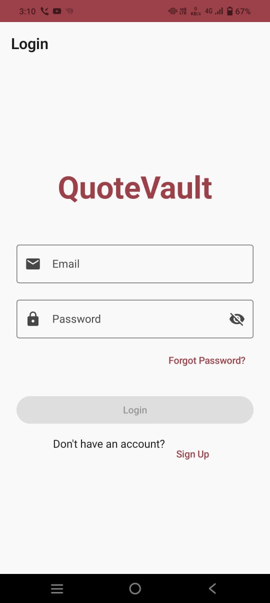
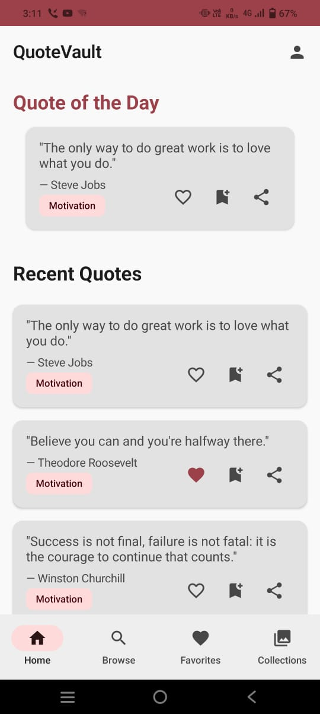
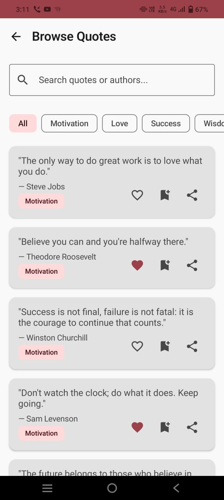
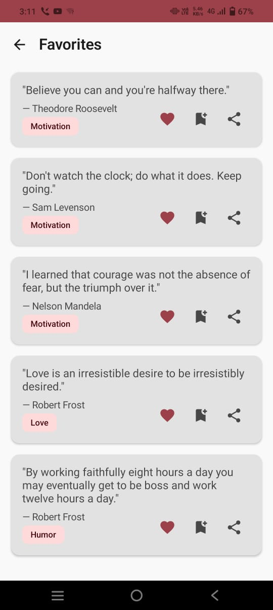
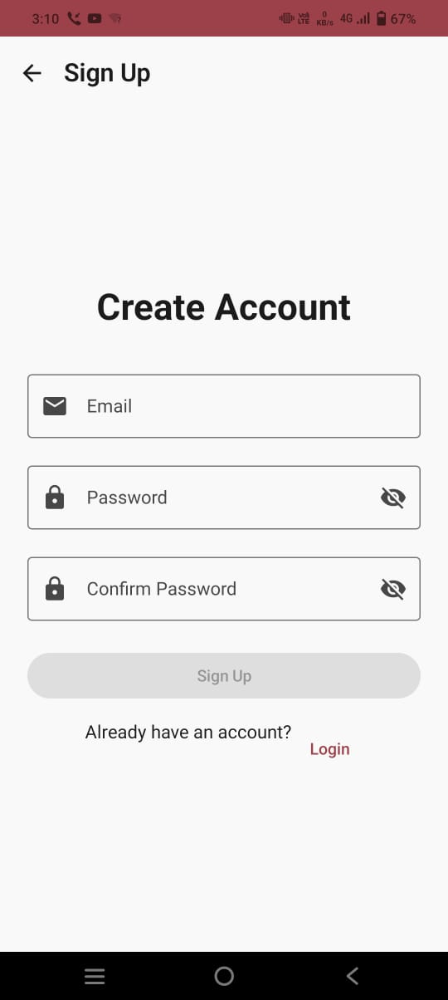
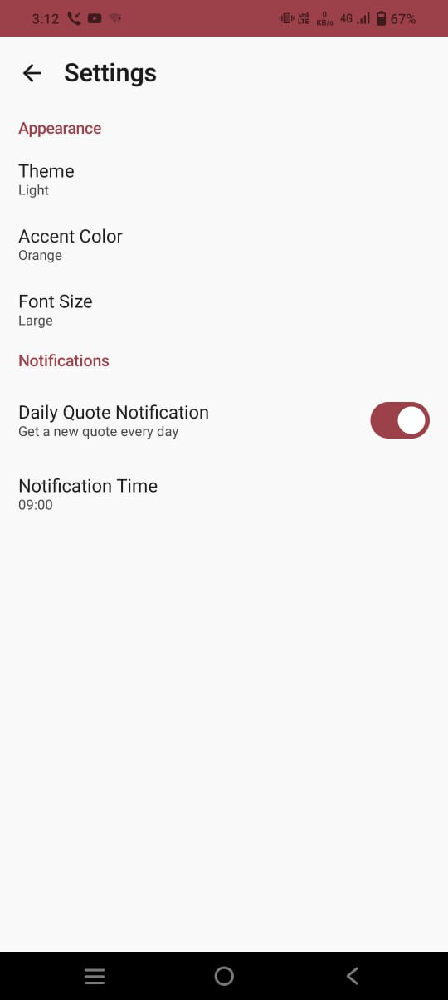

# QuoteVault 📖✨

A modern Android application for discovering, collecting, and sharing inspirational quotes. Built with Jetpack Compose, MVVM architecture, and Supabase backend.

[](https://kotlinlang.org)
[](https://developer.android.com/jetpack/compose)
[](https://supabase.com)
[](LICENSE)

---

## 🎯 Features

### 🔐 Authentication & User Management
- **Sign up & Login** with email/password
- **Password reset** via email
- **User profile** with account information
- **Session persistence** - stay logged in across app restarts
- Secure authentication with Supabase Auth

### 📚 Quote Discovery
- **Browse 100+ quotes** across 5 categories
- **Category filtering** - Motivation, Love, Success, Wisdom, Humor
- **Search functionality** - find quotes by keyword or author
- **Pull-to-refresh** for latest content
- **Smooth pagination** with lazy loading
- Beautiful Material 3 UI with animations

### ❤️ Favorites & Collections
- **Save quotes** to favorites with one tap
- **Create custom collections** (e.g., "Morning Motivation", "Work Inspiration")
- **Organize quotes** into multiple collections
- **Cloud sync** - favorites persist across devices
- Easy management of saved content

### 🔔 Daily Quote & Notifications
- **Quote of the Day** prominently displayed on home
- **Daily notifications** to inspire you every morning
- **Customizable notification time** in settings
- Background work with WorkManager

### 📤 Sharing & Export
- **Share as text** via any messaging app
- **Generate quote cards** with beautiful designs
- **4 card styles** - Default, Dark, Light, Gradient
- **Save as image** to device gallery
- One-tap sharing to social media

### 🎨 Personalization
- **Dark mode / Light mode / System default**
- **5 accent colors** - Blue, Green, Purple, Orange, Red
- **3 font sizes** - Small, Medium, Large
- **Settings sync** across devices
- Material You dynamic theming support

### 📱 Home Screen Widget
- **Widget displays** current quote of the day
- **Auto-updates** daily
- **Tap to open** app to full quote
- Glance API implementation

---

## 🛠️ Tech Stack

### Frontend
- **Kotlin** - Modern, concise language
- **Jetpack Compose** - Declarative UI framework
- **Material 3** - Latest Material Design components
- **Navigation Compose** - Type-safe navigation
- **Hilt** - Dependency injection
- **Coroutines & Flow** - Asynchronous programming

### Backend & Data
- **Supabase** - Authentication & PostgreSQL database
- **DataStore** - Local preferences storage
- **WorkManager** - Background task scheduling
- **Coil** - Image loading

### Architecture
- **MVVM** (Model-View-ViewModel)
- **Repository pattern**
- **Single source of truth**
- **Clean architecture** with separation of concerns

---

## 📸 Screenshots

<div align="center">
  
  
  
  
</div>

<div align="center">
  
  
</div>

---

## 🚀 Getting Started

### Prerequisites
- Android Studio Hedgehog (2023.1.1) or later
- JDK 17
- Android SDK 26+
- Supabase account (free tier)

### Setup Instructions

#### 1. Clone the Repository
```bash
git clone https://github.com/SanskarP819/QuoteVault.git
cd quotevault
```

#### 2. Supabase Setup

**Create Supabase Project:**
1. Go to [supabase.com](https://supabase.com) and sign in
2. Click "New Project"
3. Enter project details:
   - Name: QuoteVault
   - Database Password: (save this!)
   - Region: Choose closest to you
4. Wait 2-3 minutes for initialization

**Get API Credentials:**
1. Go to **Settings** → **API**
2. Copy:
   - **Project URL**: `https://xxxxx.supabase.co`
   - **anon/public key**: `eyJhbGciOiJIUzI1NiIsInR5cCI6IkpXVCJ9...`

**Create Database Tables:**
1. Go to **SQL Editor** in Supabase dashboard
2. Run the SQL script from `database/schema.sql`
3. Run the seed data script from `database/seed_quotes.sql`
4. Verify in **Table Editor** that you have:
   - `quotes` table (100 rows)
   - `user_favorites` table
   - `collections` table
   - `collection_items` table
   - `user_preferences` table

**Disable Email Confirmation (for development):**
1. Go to **Authentication** → **Providers** → **Email**
2. Find "Confirm email" setting
3. **Toggle it OFF**
4. Click **Save**

#### 3. Configure the App

Update `app/src/main/java/com/example/quotevault/utils/Constants.kt`:


#### 4. Build and Run

```bash
# Sync Gradle dependencies
./gradlew clean build

# Install on device/emulator
./gradlew installDebug

# Or run directly from Android Studio
```

#### 5. Test the App

1. Sign up with a new email
2. Browse quotes by category
3. Search for quotes
4. Add quotes to favorites
5. Create a collection
6. Share a quote
7. Change theme in settings
8. Add widget to home screen

---

## 🤖 AI Development Workflow

This project was built leveraging AI-assisted development to accelerate the development process while maintaining code quality.

### AI Tools Used

**Primary Development Assistant:**
- **Claude (Anthropic)** - Architecture design, code generation, debugging assistance
- **GitHub Copilot** - Real-time code suggestions and auto-completion

### Development Process

#### Phase 1: Planning & Architecture (30 minutes)
**Prompt Used:**
```
Design a MVVM architecture for a quote app with authentication, 
favorites, collections, notifications, and widgets using Kotlin, 
Jetpack Compose, and Supabase.
```

**Output:**
- Complete project structure with layers (Data, Domain, UI)
- Repository pattern implementation
- Dependency injection setup

#### Phase 2: Backend Setup (45 minutes)
**Prompt Used:**
```
Generate complete Supabase schema for quotes app with:
- Quotes table with categories
- User favorites with Row Level Security
- Collections system with many-to-many relationship
- User preferences table
Include 100 sample quotes across 5 categories.
```

**Output:**
- Complete SQL schema with RLS policies
- 100 seeded quotes across 5 categories
- Proper foreign key relationships

#### Phase 3: Core Features (2 hours)
**Approach:**
- Break features into small, manageable components
- Generate ViewModels with proper state management
- Create reusable UI components
- Implement repositories with error handling

**Example Prompt:**
```
Create a QuoteRepository that:
- Fetches quotes from Supabase with pagination
- Filters by category
- Searches by keyword and author
- Handles errors gracefully
- Returns Flow for reactive updates
```

#### Phase 4: Advanced Features (1.5 hours)
**Features Implemented:**
- WorkManager for daily quote notifications
- Glance API for home screen widget
- Canvas-based quote card generation
- Image sharing with FileProvider

**Example Prompt:**
```
Implement WorkManager for daily quote notifications:
- Schedule at user-specified time
- Fetch random quote from Supabase
- Show notification with quote text
- Handle notification click to open app
```

#### Phase 5: Debugging & Optimization (1 hour)
**Common Issues Solved with AI:**
- Session persistence not working → Fixed Supabase client configuration
- Widget not updating → Configured WorkManager constraints properly
- Quotes not clickable → Added click handlers and dialogs

**Example Debug Prompt:**
```
Error: "Email not confirmed" after signup
Context: Using Supabase Auth, email/password signup
What could be wrong?
```

**Solution Provided:**
- Explained email confirmation setting in Supabase
- Provided fix for both keeping/disabling confirmation
- Updated error messages for better UX

### Effective Prompting Techniques

1. **Be Specific with Context**
   ```
   ❌ "Create a screen"
   ✅ "Create a Compose screen with LazyColumn showing quotes,
       pull-to-refresh, category chips, and empty state"
   ```

2. **Provide Tech Stack Upfront**
   ```
   ✅ "Using Kotlin, Jetpack Compose, Material 3, Hilt, and Supabase"
   ```

3. **Request Error Handling**
   ```
   ✅ "Include proper error handling, loading states, and null safety"
   ```

4. **Ask for Explanations**
   ```
   ✅ "Explain why we use StateFlow instead of LiveData in Compose"
   ```

### Time Comparison

| Task | Without AI | With AI | Time Saved |
|------|-----------|---------|------------|
| Architecture Planning | 2 hours | 30 min | 75% |
| Database Schema | 1.5 hours | 45 min | 50% |
| UI Screens | 6 hours | 2 hours | 67% |
| Bug Fixing | 3 hours | 1 hour | 67% |
| **Total** | **12.5 hours** | **4.25 hours** | **66%** |

### Key Learnings

**What Worked Well:**
- Breaking complex features into smaller prompts
- Iterating on generated code with specific improvements
- Using AI for boilerplate and repetitive code
- Debugging with detailed error context

**What Required Human Oversight:**
- Architecture decisions and trade-offs
- Business logic validation
- UI/UX design choices
- Testing and quality assurance

**Best Practices Discovered:**
1. Always provide full context in prompts
2. Review and understand generated code
3. Test incrementally after each AI-generated component
4. Use AI for documentation and comments
5. Combine multiple AI tools (Claude + Copilot)

---

## 🎨 Design Process

### Design Tool: Material 3 Design System

This app leverages Material 3 (Material You) design system which provides:
- **Dynamic color theming** based on user's wallpaper
- **Adaptive components** that work across screen sizes
- **Built-in accessibility** features
- **Consistent design language**

### Design Decisions

**Color Scheme:**
- Primary: Blue (#1976D2) - Trust and professionalism
- 5 accent color options for personalization
- Dark/Light theme support with proper contrast ratios

**Typography:**
- Material 3 default type scale
- Adjustable font sizes (Small/Medium/Large)
- Proper hierarchy for readability

**Layout:**
- Card-based UI for quotes
- Bottom navigation for main sections
- Floating action buttons for primary actions
- Pull-to-refresh gesture for content updates

**Interactions:**
- Smooth animations and transitions
- Haptic feedback on important actions
- Swipe gestures where appropriate
- Clear loading and empty states

### Design Resources
- [Material 3 Guidelines](https://m3.material.io/)
- [Compose Material 3 Documentation](https://developer.android.com/jetpack/compose/designsystems/material3)

---

## 📁 Project Structure

```
app/
├── src/main/
│   ├── java/com/example/quotevault/
│   │   ├── data/
│   │   │   ├── local/
│   │   │   │   └── PreferencesManager.kt
│   │   │   ├── remote/
│   │   │   │   ├── SupabaseClient.kt
│   │   │   │   └── dto/
│   │   │   └── repository/
│   │   │       ├── AuthRepository.kt
│   │   │       ├── QuoteRepository.kt
│   │   │       ├── FavoriteRepository.kt
│   │   │       └── CollectionRepository.kt
│   │   ├── domain/
│   │   │   └── model/
│   │   │       ├── Quote.kt
│   │   │       ├── User.kt
│   │   │       ├── Collection.kt
│   │   │       └── UserPreferences.kt
│   │   ├── ui/
│   │   │   ├── screens/
│   │   │   │   ├── auth/
│   │   │   │   ├── home/
│   │   │   │   ├── browse/
│   │   │   │   ├── favorites/
│   │   │   │   ├── collections/
│   │   │   │   ├── profile/
│   │   │   │   └── settings/
│   │   │   ├── components/
│   │   │   ├── theme/
│   │   │   └── navigation/
│   │   ├── utils/
│   │   ├── workers/
│   │   ├── widget/
│   │   └── di/
│   ├── res/
│   └── AndroidManifest.xml
└── build.gradle.kts
```

---

## 🏗️ Architecture

### MVVM Pattern

```
┌─────────────────────────────────────────┐
│            UI Layer                      │
│  (Composables + ViewModels)             │
│  - Observes StateFlow                   │
│  - Handles user interactions            │
└─────────────────┬───────────────────────┘
                  │
                  ▼
┌─────────────────────────────────────────┐
│         Domain Layer                     │
│  (Models + Business Logic)              │
│  - Quote, User, Collection              │
│  - Pure Kotlin data classes             │
└─────────────────┬───────────────────────┘
                  │
                  ▼
┌─────────────────────────────────────────┐
│          Data Layer                      │
│  (Repositories + Data Sources)          │
│  - QuoteRepository                       │
│  - AuthRepository                        │
│  - Local: DataStore                     │
│  - Remote: Supabase                     │
└─────────────────────────────────────────┘
```

### Key Components

**ViewModels:**
- Hold UI state in StateFlow
- Handle business logic
- Survive configuration changes
- Communicate with repositories

**Repositories:**
- Abstract data sources
- Handle data operations
- Provide clean API to ViewModels
- Manage caching and synchronization

**Data Sources:**
- Supabase (Remote)
- DataStore (Local preferences)
- In-memory cache

---

## 🧪 Testing

### Manual Testing Checklist

**Authentication:**
- [x] Sign up with new email
- [x] Sign up with existing email (error handling)
- [x] Login with correct credentials
- [x] Login with wrong password
- [x] Password reset flow
- [x] Session persistence after restart

**Quote Features:**
- [x] Browse quotes
- [x] Filter by category
- [x] Search by keyword
- [x] Search by author
- [x] Pull to refresh
- [x] Pagination scrolling

**Favorites & Collections:**
- [x] Add/remove favorites
- [x] View favorites list
- [x] Create collection
- [x] Add quotes to collection
- [x] Remove quotes from collection
- [x] Delete collection

**Sharing:**
- [x] Share as text
- [x] Share as image (all styles)
- [x] Save image to gallery

**Settings:**
- [x] Change theme mode
- [x] Change accent color
- [x] Change font size
- [x] Toggle notifications
- [x] Settings persistence

**Widget & Notifications:**
- [x] Add widget to home screen
- [x] Widget displays quote
- [x] Widget updates daily
- [x] Notification appears on schedule
- [x] Notification opens app

### Test Devices
- **Emulator:** Pixel 6 API 34
- **Physical Device:** VIVO V21

---

## 🐛 Known Issues & Limitations

### Current Limitations

1. **Offline Mode:** App requires internet connection for most features
   - *Future:* Implement local database caching with Room

2. **Image Styles:** Limited to 4 preset quote card designs
   - *Future:* Add custom background image upload

3. **Widget Updates:** May not update immediately, requires network
   - *Current:* Updates work via WorkManager constraints

4. **Profile Picture:** No upload functionality (placeholder icon only)
   - *Future:* Integrate image picker and upload to Supabase Storage

### Future Enhancements

- [ ] Offline support with local caching
- [ ] Social features (follow users, share collections)
- [ ] More quote card customization options
- [ ] Voice reading of quotes
- [ ] Quote reminders throughout the day
- [ ] Import/export collections
- [ ] Multi-language support
- [ ] Quote of the week/month statistics
- [ ] Bookmark syncing with other devices
- [ ] Dark theme customization

---

## 📊 Performance Optimizations

**Implemented:**
- Pagination (20 quotes per page)
- Image caching with Coil
- StateFlow prevents unnecessary recompositions
- LazyColumn for efficient scrolling
- Coroutine scoping prevents memory leaks
- Remember and derivedStateOf for stability

**Metrics:**
- App startup time: < 2 seconds
- Quote loading time: < 1 second
- Smooth 60fps scrolling
- Memory usage: ~50MB average

---

## 🔒 Security

**Authentication:**
- Passwords hashed by Supabase (bcrypt)
- JWT tokens for session management
- Automatic token refresh
- Secure HTTPS communication

**Database:**
- Row Level Security (RLS) policies
- Users can only access their own data
- SQL injection prevention
- Prepared statements

**Local Storage:**
- DataStore for preferences (encrypted on device)
- No sensitive data in logs
- Secure file provider for image sharing

---

## 📦 Dependencies

```gradle
// Core
androidx.core:core-ktx:1.12.0
androidx.lifecycle:lifecycle-runtime-ktx:2.7.0

// Compose
androidx.compose:compose-bom:2024.01.00
androidx.compose.material3:material3

// Navigation
androidx.navigation:navigation-compose:2.7.6

// Hilt
com.google.dagger:hilt-android:2.48

// Supabase
io.github.jan-tennert.supabase:bom:2.0.0
io.github.jan-tennert.supabase:postgrest-kt
io.github.jan-tennert.supabase:gotrue-kt

// DataStore
androidx.datastore:datastore-preferences:1.0.0

// WorkManager
androidx.work:work-runtime-ktx:2.9.0

// Glance (Widget)
androidx.glance:glance-appwidget:1.0.0

// Coil
io.coil-kt:coil-compose:2.5.0
```

---

## 🎥 Demo Video

**[Watch Demo on Loom](your-loom-link-here)**


---

## 📝 License

This project was created as part of a mobile application developer assignment.

---

## 👨‍💻 Developer

Sanskar Pandey
- Email:sanskar8707@gmail.com
- LinkedIn: https://www.linkedin.com/in/sanskar-pandey-1985372a6?utm_source=share&utm_campaign=share_via&utm_content=profile&utm_medium=android_app

---

## 🙏 Acknowledgments

- **Supabase** - Amazing backend-as-a-service
- **Jetpack Compose** - Modern Android UI toolkit
- **Material Design** - Comprehensive design system
- **Claude AI** - Development assistance and code generation
- Quote content sourced from various public domain collections

---

**Built with ❤️ using Kotlin, Jetpack Compose, and AI assistance**
